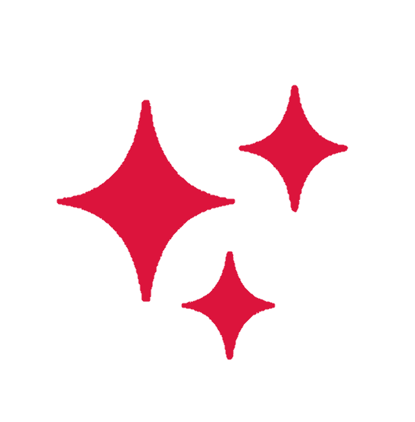

# THIS PROJECT IS ACTIVELY BEING BUILT AND NOT FUNCTIONAL YET.

<br>

<div align="center">

</div>

<br>

<p>
    
**DBotLang (.dbot)** is a cute little programming language for building Discord bots. It aims to make bot development easier by providing built-in concepts for commands, events, variables, and bot logic without the boilerplate of traditional bot frameworks. 
</p>

<!--  


</div>
-->

<h2>
  Features
   
</h2>

- Variables
- Strings, numbers, booleans, and null
- Commands
- Events
- `if` / `else` statements
- `return` statements

*More features will be added as the language develops.*

## Example

```dbotlang
command ping:
    return "Pong!"
```

## License 

This project is under the [MIT License →](LICENSE)
