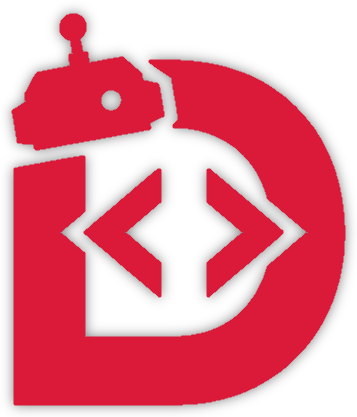

<div align="center">

    
<br>
<br>


</div>

<br>

<h1>
  DBotLang
   
</h1>

DBotLang is a programming language for building Discord bots. I wanted to make bot development easier by providing built-in concepts for commands, events, variables, and bot logic without the boilerplate of traditional bot frameworks.

<h2>
  Features
   
</h2>

- Variables
- Strings, numbers, booleans, and null
- Commands
- Events
- `if` / `else` statements
- `return` statements
- Keywords
- Discord integration

*More features will be added as the language develops.*

## Example

```dbotlang
command ping:
    return "Pong!"
```
